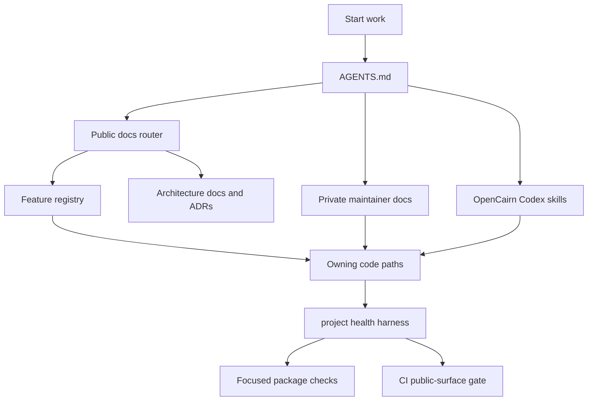

# Architecture Maps

These maps are the low-friction entry point for understanding OpenCairn when
the repository feels too large to navigate from prose alone. They do not replace
the public architecture documents, the feature registry, or private maintainer
status notes. They point to the right source of truth and show the expected
route from context to verification.

## Read First

| Need | Map |
| --- | --- |
| Monorepo layer and package dependency overview | [system-map.md](./system-map.md) |
| Feature ownership and verification routing | [feature-verification-map.md](./feature-verification-map.md) |
| Agentic workflow flow across actions, runs, and artifacts | [agentic-workflow-map.md](./agentic-workflow-map.md) |
| Maintainer context, private docs, skills, and agent flow | [maintainer-context-map.md](./maintainer-context-map.md) |
| Verification harness, CI drift, and test selection | [testing-map.md](./testing-map.md) |

## How To View

Open this directory in GitHub or use VS Code's Markdown Preview. The diagrams
are Mermaid blocks, so GitHub and current VS Code Markdown Preview render them
without a separate generated image file. If a viewer only shows code blocks,
install or enable Mermaid preview support and keep this Markdown as the source
of truth.

## Operating Model

Use `pnpm check:health` before a PR, after changing repo guidance, or whenever
the docs, skills, code boundaries, and CI gates feel out of sync.
