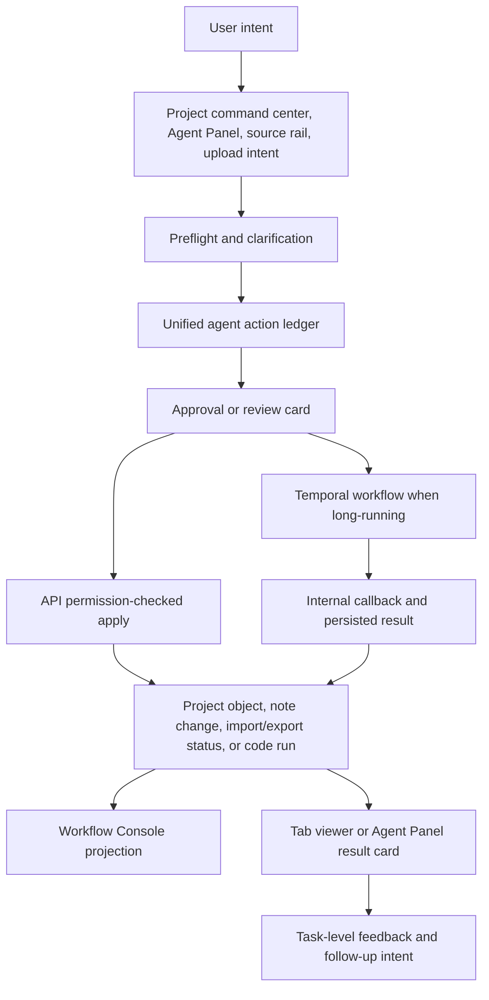

# Agentic Workflow Map

OpenCairn has several agent-facing surfaces, but new write-capable work should
route through shared actions, run projections, and review surfaces instead of
adding chat-only mutation paths.

## Routing Rules

| Work type | Preferred substrate |
| --- | --- |
| Note create/update/delete/restore | Unified `agent_actions` note actions with review/apply when needed |
| Generated files and document artifacts | Project-object and agent-file paths, worker jobs for binary output |
| Import/export workflows | Existing import/export workflows projected into the action/run surfaces |
| Code workspace changes | Code project actions, approved run/install/preview substrates |
| Status UI | Workflow Console projection before adding another run/status panel |

This map summarizes the current product direction. The detailed contracts live
in `docs/architecture/agentic-workflow-roadmap.md`,
`docs/architecture/document-generation-ide-flow.md`, and the feature registry.
