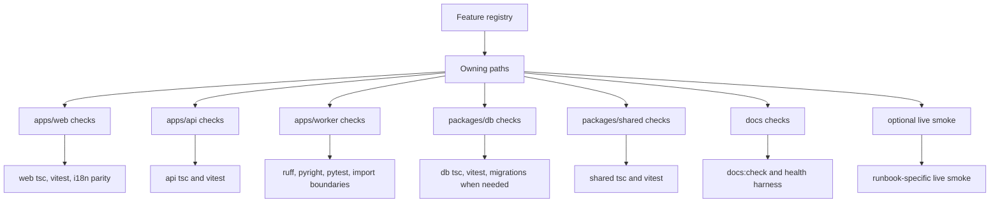

# Feature Verification Map

This map connects feature ownership to verification. The detailed source of
truth remains `docs/contributing/feature-registry.md`; this page shows the
pattern to follow when choosing checks.

## Common Feature Families

| Feature family | Primary owning surfaces | Typical verification |
| --- | --- | --- |
| Agent Panel and shell UX | `apps/web`, shared API client contracts | web focused vitest, web tsc, i18n parity |
| Agent actions and workflow console | `packages/shared`, `packages/db`, `apps/api`, `apps/web` | shared/api/db tsc, focused api/web tests, health harness |
| Document generation and exports | `apps/api`, `apps/worker`, `apps/web`, object storage callbacks | focused api/web/worker tests plus live smoke when callback/storage behavior changes |
| Ingest and import/export | `apps/api`, `apps/worker`, `packages/db`, `apps/web` | api/worker tests, db migration checks when schema changes, optional import smoke |
| RAG, graph, and retrieval | `apps/api`, `apps/worker`, `packages/db`, `packages/llm` | focused retrieval tests, worker tests, provider parity checks |
| Collaboration | `apps/hocuspocus`, `apps/api`, `packages/db`, editor UI | hocuspocus tests, api permission tests, selected Playwright collaboration smoke |

When the feature registry and this map disagree, update the registry first and
then revise this summary.
