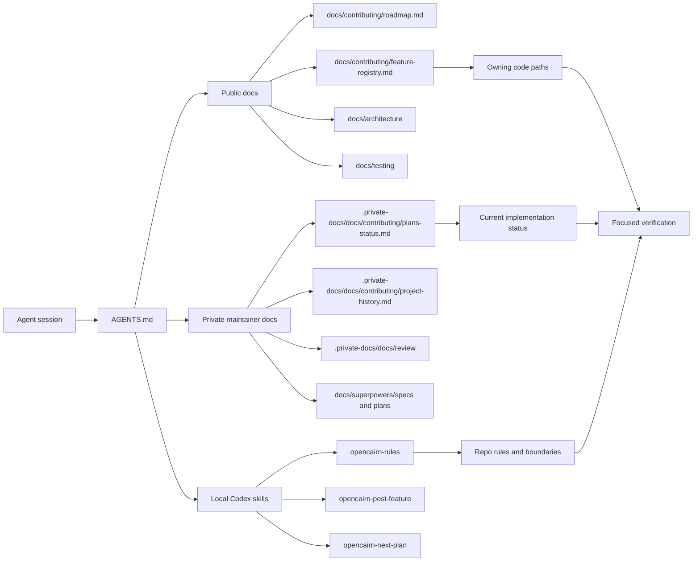

# Maintainer Context Map

OpenCairn has three kinds of context. Keeping them separate prevents public
docs from becoming raw execution logs and prevents private handoffs from
becoming hidden product contracts.

## Context Layers

## Source Of Truth

| Question | Source |
| --- | --- |
| What does the public project claim? | `docs/contributing/roadmap.md` |
| Where should a feature be extended? | `docs/contributing/feature-registry.md` |
| What is the current local maintainer status? | `.private-docs/docs/contributing/plans-status.md` |
| What agent rules apply before code changes? | `AGENTS.md` and `opencairn-rules` |
| What should be checked before completion? | `pnpm check:health`, focused package checks, and `opencairn-post-feature` |

Private maintainer docs and ignored Superpowers plans are local operator
context. They can guide work, but they should not be copied into public docs or
PR bodies unless the maintainer explicitly asks for that.
