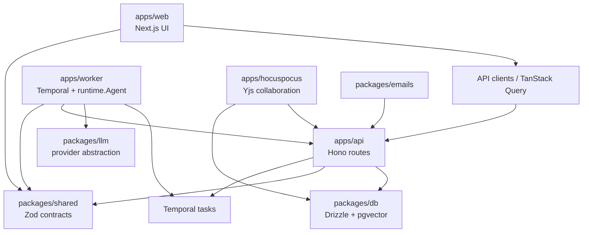

# System Map

This map shows the high-level package/runtime boundary. For feature-level
ownership, use the feature registry and [feature-verification-map.md](./feature-verification-map.md).

## Boundary Rules

- `apps/web` must not import `packages/db`, `apps/api`, or Server Actions.
- `packages/shared` must not import application packages or database code.
- `packages/db` must not import application packages.
- Worker agents must extend the local runtime and must not introduce LangGraph
  or LangChain as the control-plane abstraction.
- Long-running work belongs in Temporal-backed worker flows, not web request
  handlers.
