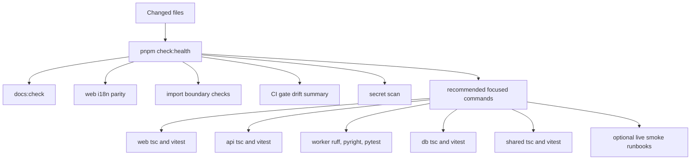

# Testing And Harness Map

The test suite is broad, but broad coverage is only useful when developers know
which checks protect the change they just made. The health harness is the
fastest route from changed files to recommended verification.

## Harness Flow

## Current Gate Split

| Layer | Current automated surface |
| --- | --- |
| Public docs paths and feature registry paths | `pnpm docs:check` |
| Maintainer context, import boundaries, CI drift, recommended checks | `pnpm check:health` |
| Lightweight committed-secret scan | `pnpm check:secrets` |
| Web translation key parity | `pnpm --filter @opencairn/web i18n:parity` |
| TypeScript package boundaries | `pnpm check:types` |
| Fast unit suites | `pnpm check:unit:fast` |
| Active development gates: Hocuspocus websocket smoke, web/API full unit suites, worker lint/type, E2E, live smoke | Run as focused local/PR verification until each track is stabilized and intentionally promoted |

## When To Use Live Smoke

Use live smoke only when the change crosses real infrastructure boundaries such
as database migrations, object storage, Temporal workflows, Google provider
exports, or browser-rendered generated artifacts. Keep ordinary UI and contract
changes on focused unit, component, type, and boundary checks.
